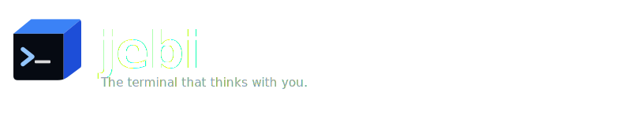

<p align="center">
  
</p>

<p align="center">
  <a href="https://github.com/jebi-sh/jebi/releases/latest"></a>
  
  
</p>

---

jebi is a terminal emulator for Mac with built-in local AI. It explains failed commands, suggests what to run next, and lets you ask questions about your session — all without an API key or internet connection.

---

<!-- Drop a demo.mp4 into assets/ and uncomment:
<p align="center">
  <video src="assets/demo.mp4" width="700" autoplay loop muted playsinline></video>
</p>
-->

## Features

### Built-in Local AI
- **Error explanations** — when a command fails, jebi explains why and how to fix it
- **Next-command suggestions** — 3 smart suggestions after every run, shown as clickable chips
- **`/ask`** — chat with AI about your current session, files, and environment
- **No API key, no subscription, no cloud** — AI runs entirely on your Mac via llama.cpp
- Choose from 7 bundled models: Qwen3 4B/8B, Gemma 3 4B, Qwen2.5-Coder 3B, and more
- Download, switch, and delete models from Preferences → AI

### Slash Commands
- `/ls` — file explorer with preview
- `/ports` — live network port inspector
- `/run` — Makefile & npm scripts picker
- `/ask` — AI chat in the terminal
- Define your own custom `/commands` in Preferences with dynamic item lists

### Workspace
- Multiple tabs with per-tab accent colors
- Split panes horizontally or vertically (`⌘D` / `⌘⇧D`)
- Smart prompt segments — git branch, Node, Go, Python, Docker, K8s status
- Click any prompt segment to copy its value
- Smart command history with prefix filtering
- WebGL-accelerated rendering via xterm.js

### Quality of Life
- **Check for updates** — version shown in status bar, update notification with one-click upgrade instructions
- **Long command support** — commands of any length sent via temp file to bypass macOS PTY limits
- 7 built-in themes: Catppuccin Mocha, Tokyo Night, Dracula, Nord, Gruvbox, One Dark, Monokai

---

## Install

```bash
brew install --cask jebi-sh/tap/jebi
```

Or download the latest DMG from the [releases page](https://github.com/jebi-sh/jebi/releases) — available for Apple Silicon and Intel.

---

## Build from source

**Prerequisites:** Node.js 18+, Go 1.21+, Make

```bash
git clone https://github.com/jebi-sh/jebi.git
cd jebi
make deps   # download llama.cpp binaries (~30s)
make dev    # run in development mode
make build  # package the app (DMG + ZIP)
```

---

## AI Models

jebi ships with a model registry you can manage from **Preferences → AI**:

| Model | Size | Best for |
|---|---|---|
| Qwen3 4B | 2.5 GB | Great all-round quality |
| Qwen3 8B | 5 GB | Best quality |
| Gemma 3 4B | 2.5 GB | Balanced |
| Qwen2.5-Coder 3B | 1.9 GB | Code & terminal focus |
| Qwen2.5 1.5B | 1.1 GB | Fastest, lowest memory |
| Phi-3 Mini 3.8B | 2.2 GB | High quality |
| Gemma 2 2B | 1.6 GB | Balanced |

Models are downloaded on demand and stored in `~/Library/Application Support/jebi/models/`.

---

## Keyboard shortcuts

| Shortcut | Action |
|---|---|
| `⌘T` | New tab |
| `⌘W` | Close tab / pane |
| `⌘D` | Split pane horizontally |
| `⌘⇧D` | Split pane vertically |
| `⌘K` | Clear screen |
| `⌘F` | Search scrollback |
| `⌘,` | Open Preferences |
| `/` | Open command palette |
| `⌘⇧1/2/3` | Run AI suggestion 1/2/3 |

---

## License

[FSL-1.1-ALv2](LICENSE) — free to use, fork, modify, and contribute. Commercial use that competes with jebi is not permitted. Converts to Apache 2.0 two years from each release date.
